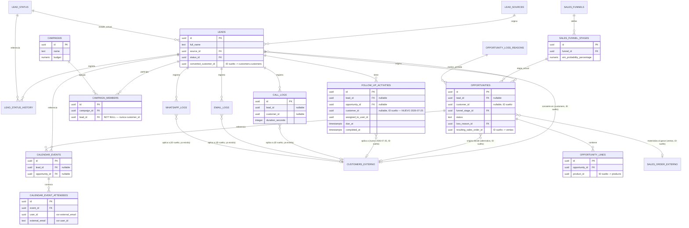

# Diagrama ER — Base de Datos CRM/Customers

> Entregable de la fase "CRM — Parte 02 (Base de Datos)". Cubre los dos
> schemas reales que juntos responden al pedido de "base de datos CRM
> completa": `customers` (maestro de clientes, 20 tablas + 1 vista) y `crm`
> (leads/oportunidades/campañas/agenda/seguimientos, 17 tablas). Columnas
> de auditoría universales (`tenant_id`/`company_id`/`branch_id`/
> `created_at`/`updated_at`/`deleted_at`/`created_by`/`updated_by`/
> `deleted_by`/`version`/`row_version`/`is_active`/`is_deleted`/
> `observations`/`metadata`) se omiten del diagrama por legibilidad — están
> en **todas** las tablas sin excepción, ver
> [docs/database/dictionary/03-customers.md](../../database/dictionary/03-customers.md)/
> [13-crm.md](../../database/dictionary/13-crm.md) para el detalle columna
> por columna.

## 1. Schema `customers` — maestro de clientes (20 tablas + 1 vista)

```mermaid
erDiagram
    CUSTOMERS ||--o{ CUSTOMER_ADDRESSES : tiene
    CUSTOMERS ||--o{ CUSTOMER_CONTACTS : tiene
    CUSTOMERS ||--o{ CUSTOMER_BANK_ACCOUNTS : tiene
    CUSTOMERS ||--o{ CUSTOMER_REFERENCES : tiene
    CUSTOMERS ||--o{ CUSTOMER_DISCOUNTS : tiene
    CUSTOMERS ||--o{ CUSTOMER_PRICE_LISTS : tiene
    CUSTOMERS ||--o{ CUSTOMER_CREDIT_PROFILES : tiene
    CUSTOMERS ||--o{ CUSTOMER_CREDIT_LIMIT_HISTORY : registra
    CUSTOMERS ||--o{ CUSTOMER_BLOCK_HISTORY : registra
    CUSTOMERS ||--o{ CUSTOMER_STATEMENTS : genera
    CUSTOMERS ||--o{ CUSTOMER_LOYALTY_ACCOUNTS : tiene
    CUSTOMERS ||--o{ CUSTOMER_WISHLIST_ITEMS : tiene
    CUSTOMERS ||--o{ CUSTOMER_VISITS : recibe
    CUSTOMERS ||--o{ CUSTOMER_NOTES : tiene
    CUSTOMERS ||--o{ CUSTOMER_RATINGS : tiene
    CUSTOMERS }o--o| CUSTOMER_CATEGORIES : clasificado_en
    CUSTOMERS }o--o| CUSTOMER_CLASSIFICATIONS : clasificado_en
    SALES_ROUTES ||--o{ SALES_ROUTE_CUSTOMERS : incluye
    CUSTOMERS ||--o{ SALES_ROUTE_CUSTOMERS : visitado_en
    CUSTOMERS ||--o{ V_CUSTOMER_TIMELINE : "agrega (vista, sin FK real)"

    CUSTOMERS {
        uuid id PK
        text legal_name
        text trade_name
        text tax_id
        char preferred_currency_code
        uuid assigned_salesperson_id "ID suelto -> sales.salespeople"
        boolean is_blocked
        uuid classification_id FK
        uuid category_id FK
    }
    CUSTOMER_ADDRESSES {
        uuid id PK
        uuid customer_id FK
        text address_type
        text line1
        boolean is_default
    }
    CUSTOMER_CONTACTS {
        uuid id PK
        uuid customer_id FK
        text full_name
        text email
        boolean is_primary
    }
    CUSTOMER_CREDIT_PROFILES {
        uuid id PK
        uuid customer_id FK
        numeric credit_limit
        integer payment_terms_days
    }
    CUSTOMER_CREDIT_LIMIT_HISTORY {
        uuid id PK
        uuid customer_id FK
        numeric previous_limit
        numeric new_limit
    }
    CUSTOMER_PRICE_LISTS {
        uuid id PK
        uuid customer_id FK
        uuid price_list_id "ID suelto -> configuration"
    }
    CUSTOMER_NOTES {
        uuid id PK
        uuid customer_id FK
        uuid author_user_id
        text note_text
        boolean is_pinned
    }
    CUSTOMER_RATINGS {
        uuid id PK
        uuid customer_id FK
        uuid rated_by_user_id
        text rating_type
        numeric score
    }
    CUSTOMER_STATEMENTS {
        uuid id PK
        uuid customer_id FK
        date period_start
        date period_end
        numeric closing_balance
    }
    CUSTOMER_BLOCK_HISTORY {
        uuid id PK
        uuid customer_id FK
        text action
        text reason
    }
    CUSTOMER_VISITS {
        uuid id PK
        uuid customer_id FK
        uuid route_id FK
        timestamptz visited_at
    }
    CUSTOMER_CATEGORIES {
        uuid id PK
        text name
    }
    CUSTOMER_CLASSIFICATIONS {
        uuid id PK
        text name
    }
    SALES_ROUTES {
        uuid id PK
        text name
    }
    SALES_ROUTE_CUSTOMERS {
        uuid id PK
        uuid route_id FK
        uuid customer_id FK
        smallint visit_order
    }
    V_CUSTOMER_TIMELINE {
        uuid customer_id
        text event_type
        timestamptz event_at
        text summary
    }
```

**Nuevo en esta fase** (2026-07-25, `sql/36_crm_customer_completion.sql`):
`CUSTOMER_NOTES`, `CUSTOMER_RATINGS`, `V_CUSTOMER_TIMELINE`. El resto (17
tablas + 1 vista) ya existía, certificado Enterprise v1.1.0 — no se tocó su
estructura.

## 2. Schema `crm` — leads, oportunidades, campañas, agenda, seguimientos (17 tablas)

**Nuevo en esta fase**: solo `FOLLOW_UP_ACTIVITIES.customer_id`. Las 17
tablas siguen siendo 17 — ninguna tabla nueva en este schema, era el que
menos brechas reales tenía (`call_logs`/`email_logs`/`whatsapp_logs` ya
soportaban `customer_id` desde el diseño original).

## 3. Qué NO se modeló como tabla nueva (decisión explícita, no omisión)

| Item pedido                                   | Dónde vive realmente                                                                                               | Por qué no es una tabla nueva                                                                                                                                       |
| --------------------------------------------- | ------------------------------------------------------------------------------------------------------------------ | ------------------------------------------------------------------------------------------------------------------------------------------------------------------- |
| Customer tags                                 | `core.entity_tags` (`entity_type='customers.customers'`) + `core.tags`                                             | Mecanismo polimórfico genérico ya construido, usado por todo el proyecto — una tabla `customer_tags` sería una segunda implementación redundante del mismo concepto |
| Customer documents / Customer attachments     | `core.documents` (`source_module='customers'`, `source_entity_id`) + `core.files`                                  | Mismo argumento — mecanismo de adjuntos genérico ya construido y usado por todos los módulos                                                                        |
| Customer groups                               | `customer_categories` + `customer_classifications` (dos taxonomías ya existentes)                                  | Una tercera tabla de "grupos" sería una tercera taxonomía redundante sin diferencia estructural real frente a las dos que ya existen                                |
| Sales representatives                         | `sales.salespeople` (ya existe, referenciado por `assigned_salesperson_id` como ID suelto desde `customers`/`crm`) | Entidad ya modelada en otro schema — `customers`/`crm` correctamente no duplican al vendedor, solo lo referencian                                                   |
| Customer activities (bitácora de interacción) | `crm.call_logs`/`email_logs`/`whatsapp_logs` — **ya tenían `customer_id`** antes de esta fase                      | No era un gap — verificado en la auditoría antes de escribir la migración                                                                                           |

Ver [`CRM_ARCHITECTURE.md`](./CRM_ARCHITECTURE.md) para la arquitectura de
código (entidades, servicios, repositorios) y
[`CRM_ROADMAP.md`](./CRM_ROADMAP.md) para el plan de implementación.
